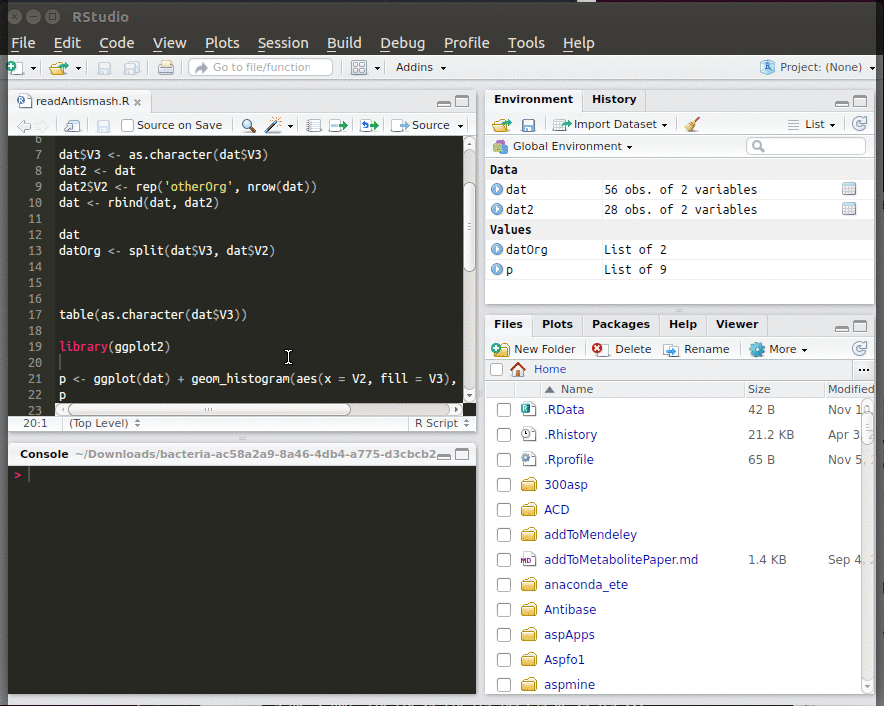
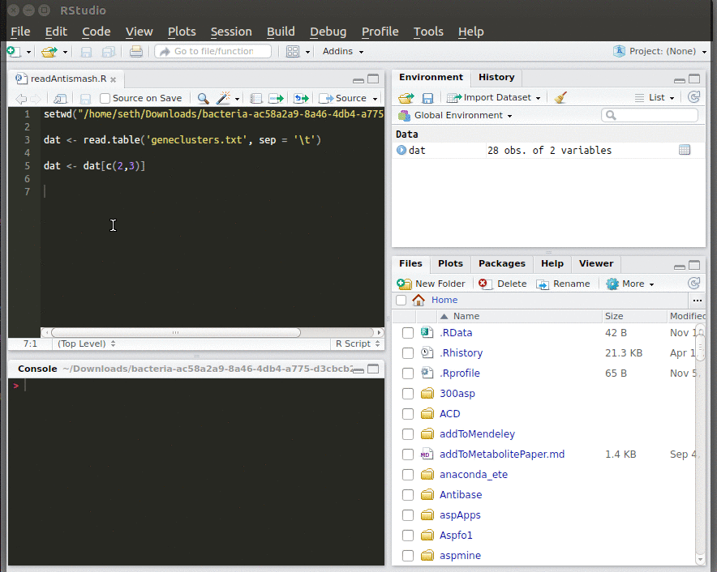

# Installing Rstudio

In order to work on antiSMASH data from multiple organisms we will use R during this course. Install R from this [site](https://cran.rstudio.com/) choose your system and follow the instructions. You should also install Rstudio (choose RStudio Desktop Open Source License FREE)
from this [site](https://www.rstudio.com/products/RStudio/).

## Working in Rstudio

Rstudio is an integrated development environment (IDE), meaning it provides you with an interface to write your script, execute it, inspect your workspace (data loaded in memory) and manage packages.

#### Writing and executing code

When typing into the script, Rstudio will suggest you functions that match the word you are typing. To autocomplete, select the right function with the arrow keys and press the ```tab``` or ```enter``` key.

Executing code:
* Once you are finished with a line of code, you can execute it by ```ctrl + enter``` (```cmd + enter``` for Mac, or the button clicked in the video).
* Select blocks of code with the mouse and hit ```ctrl + enter``` to execute a whole code block.


## Installing packages

Packages are collections of functions that help you in your work. The R community has developed a vast amount of helpful packages which can be downloaded from inside Rstudio. To install a package, select the **Packages** tab, click **Install** and type in the package you need.

Before using functions of a package you have to load it. Either select the package under the **Packages** tab or write ```library(packageName)``` in your script and execute the line.

  

### Before starting the course you should have the following packages installed:

* ggplot2
* reshape2
* ape
* RColorBrewer
* gplots


## How to get help

The documentation on R functions are a good starting point. You can either access the *Help* tab on the bottom right window or type ```?function``` in your script and execute it.


