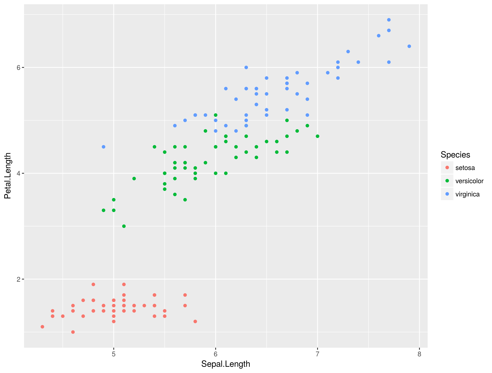
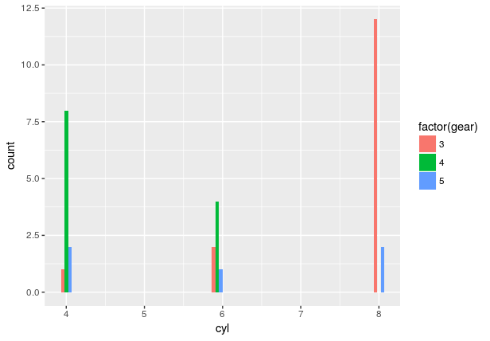

# Why working with R?

Antismash is already providing many functions and analysis tools in it's web interface. However, projects often involve newly sequenced organisms that are not available in public databases yet and only owned by you. Therefore, you have to perform certain analyses on your own, including unpublished and non analysed data.

Learning R will help you in handling the increasing  amount of data. Projects working on 100 to 300 genomes simultaneously are common and certain projects combine analyses of [1000 genomes](http://genome.jgi.doe.gov/programs/fungi/1000fungalgenomes.jsf).


More data will become available and it will become increasingly important to work on these in a high throughput as well as reproducible manner.


# Working with R

## R basics

R works with vectors of different kinds which is similar to other programming languages. However, the syntax is a bit different. ```c()``` in the example below is a function which *concatenates* the numeric values *1,2,3,4,5* to a numeric vector.

```
a <- c(1,2,3,4,5) # assigns a numeric vector from 1 to 5 to the variable a
a <- seq(5)       # does the same as the line above using the seq function
sum(a)            # calculates the sum of a
length(a)
class(a)


letters          
class(letters)
b <- letters[1:20] # subsetting for first to 20th character
c <- letters[10:20]
d <- letters[15:25]
union(b,c,d)

```
* What do the ```length()``` and ```class()``` functions tell you?
* How does the ```union()``` function differ from the ```c()``` function?
* How can you find the shared characters between b and c? Tip: Try the help function on ```union()```


## Reading data into R

We can read in data using functions:

```r
dat <- read.table("example.tsv", sep = '\t') # Reading example file
head(dat)                                    # Showing the header
str(dat)                                     # Overview of observations (rows) and variables (columns)
```

In the following tutorial we will use built in datasets. In the exercises we will read in a dataset.

## Data frames and built in datasets

R's favorite data structure is the data frame which is a table containing different numeric values, as well as descriptive values like characters or factors. R has a few build in datasets like the iris dataset.

> This famous (Fisher's or Anderson's) iris data set gives the measurements in centimeters of the variables sepal length and width and petal length and width, respectively, for 50 flowers from each of 3 species of iris. The species are Iris setosa, versicolor, and virginica.

## Data Overview

```r
> head(iris)
  Sepal.Length Sepal.Width Petal.Length Petal.Width Species
1          5.1         3.5          1.4         0.2  setosa
2          4.9         3.0          1.4         0.2  setosa
3          4.7         3.2          1.3         0.2  setosa
4          4.6         3.1          1.5         0.2  setosa
5          5.0         3.6          1.4         0.2  setosa
6          5.4         3.9          1.7         0.4  setosa

> str(iris)
'data.frame':	150 obs. of  5 variables:
 $ Sepal.Length: num  5.1 4.9 4.7 4.6 5 5.4 4.6 5 4.4 4.9 ...
 $ Sepal.Width : num  3.5 3 3.2 3.1 3.6 3.9 3.4 3.4 2.9 3.1 ...
 $ Petal.Length: num  1.4 1.4 1.3 1.5 1.4 1.7 1.4 1.5 1.4 1.5 ...
 $ Petal.Width : num  0.2 0.2 0.2 0.2 0.2 0.4 0.3 0.2 0.2 0.1 ...
 $ Species     : Factor w/ 3 levels "setosa","versicolor",..: 1 1 1 1 1 1 1 1 1 1 ...
```

Quick recap of plant biology:


## Subsetting

Data frames and other types of data can be subsetted to concentrate on certain groups of organisms, enzymes etc. We need to cover some more concepts to understand subsetting.

Try the following lines and describe what you get as a result:

```r
iris
iris$species
iris$species == 'setosa'
iris[c(1,2,3),]
iris[,c(1,2)]
```

We combine now two terms to subset our data frame:

```r
iris[iris$species == 'setosa',]
```

Theres a lot of commands in that one line of code. On the outside we tell R to access the rows of the data frame ```iris[rows,columns]``` and on the inside we create a boolean vector (TRUE, FALSE statement) checking the whole column of ```iris$species``` if they are containing the term ```'setosa'```. Remember that single ```=``` will mean an assignment operation like in ```a = 1``` and only double equation marks ```==``` will create a comparison.


## Merging

Often we need to combine

## ggplot2 basics

ggplot2 requires your dataframe in the first argument ```ggplot(yourDataFrame)``` afterwards you specify the type of plot like e.g. ```geom_point()``` and set the aesthetic mapping inside the latter function. Aesthetics tell ggplot the variables for each axis ```x,y``` and the groups you want to specify by ```color```.
In the follwing example we use the standard R iris dataset and plot length of petals against length of sepals.

```r
ggplot(iris)+ geom_point(aes(x = Sepal.Length, y = Petal.Length, color = Species))
```


### Using more geoms

Geoms are the types of plots you can create with ggplot2. Try typing ```geom_``` in Rstudio and see what Rstudio suggests to you.

One useful geom is the histogram ```geom_histogram```. This time we specify *fill* to color the inside of the plot objects. Above we had to use color because it affects the stroke of the plot data. In the below example we need to use the ```factor()``` function to create groups of data from numeric data. Try ```mtcars$gear``` vs ```factor(mtcars$gear)```, what is the difference?

```r
head(mtcars)

ggplot(mtcars) + geom_histogram(aes(x = cyl, fill = factor(gear)), position = 'dodge')
```



<!-- ggplot(mtcars) + geom_histogram(aes(x = cyl, fill = factor(gear)), position = 'dodge') +scale_x_continuous(breaks = c(4,6,8), labels = c('low','mid','high')) -->

### More basic functions


#### aggregate

The aggregate function is very helpful for summary statistics. In case you want to know, e.g. what the average petal length per species is. Aggregates syntax follows ```aggregate(varOfInterest ~ groupVar)```.

```r
aggregate(Petal.Length ~ Species, data = iris , FUN =  mean)
```

* What is the mean Petal.Length for each species?
* What is the mean Sepal.Width for each species?


#### split

Split let's you split a data frame into a list. This is helpful for many downstream applications and readability (more on this later).

```r
irisL <- split(iris, iris$Species) # creating a list of the iris dataset

iris # print and see

irisL['versicolor ']
irisL[['versicolor ']]

```
* What is the difference between the last two statements? Tip: Use the ```class()``` function on the sublist of *versicolor* species but also print it to spot the difference

#### merge

Often you want to merge datasets. E.g. if you have annotation data from different sources.


```r
merge(dfA, dfB, by = "commonCol")

```


### Introduction to lapply and sapply

The apply family of functions working similar to for-loops, meaning:

```r
nrow(iris) # will give you the number of rows for the entire data frame

irisL

for(x in irisL){
  nrow(element)
}

lapply(l, nrow) # Is basically the same as above.

lapply(irisL, function(x){
  x
  })

```

The function ```lapply``` will retain the list structure while ```sapply``` is simplifying the result to a vector.


# More info on R

A more detailed introduction to R can be found on another [course page](https://cmgbiotech.wordpress.com/tutorials/introduction-to-r/)
